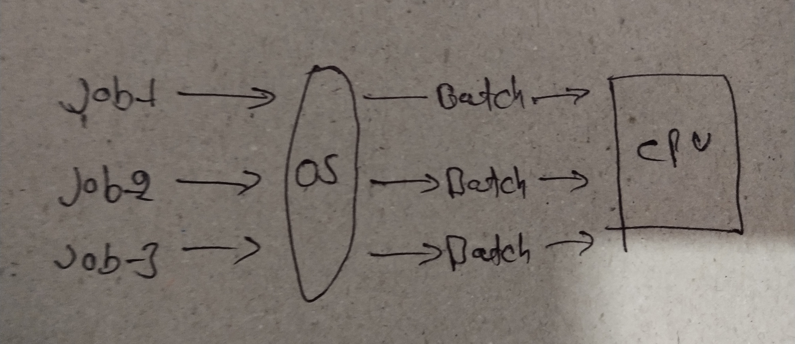

# Batch Operating Systems and Multiprogramming

## Overview:

This document provides an explanation of batch operating systems, single batch processing, and multiprogramming. These concepts are fundamental in understanding how operating systems manage and execute tasks efficiently.

## Batch Operating Systems:

it was very popular in the 1970s. A batch operating system is a type of operating system where users submit a sequence or "batch" of jobs to the computer for execution. These jobs are typically executed sequentially without user intervention. The operating system collects and processes these jobs in batches, maximizing the computer's utilization by executing multiple jobs one after another.

### common activities 

* A job is a single unit that consists of a sequence of commands, data, and programs.

* first come, first serve.

* jobs are stored in memory and executed without the need for manual information.

* When a job is successfully run, the operating system releases its memory.

### Characteristics

#### Sequential Execution:

* In a batch operating system, the CPU executes tasks in the order they are received, following a "first come, first served" approach. The task sent to the CPU first will be executed first.
Jobs:

* A "job" refers to the command or instruction that a user or program wants to perform on the system.

#### Batch Processing:

* The batch operating system handles a group of user-supplied instructions, which consist of various programs and commands with similarities.

#### Memory Management:

* When a task is completed successfully, the operating system releases the memory space allocated to that particular job, making it available for other tasks.

#### Operator Interface:

* In a batch operating system, users don't directly interact with the operating system. Instead, they send all their instructions to an operator.

#### Job Grouping:

* The operator reviews the instructions received from users and groups them based on their similarities, creating sets of instructions to be executed together.
These characteristics help streamline the execution of tasks in a batch operating system, improving efficiency and resource utilization.

## Advantages and Disadvantages of Batch Operating System

### Advantages

- **Efficient Resource Utilization**: Batch operating systems maximize resource utilization by executing multiple tasks sequentially without idle time.

- **Workload Management**: They effectively manage large volumes of tasks by organizing them into batches, ensuring smooth execution.

- **Predictable Performance**: Batch systems provide predictability in job execution times, facilitating better planning and scheduling of tasks.

- **Automated Processing**: Once a task is completed, the next job in the queue is automatically processed, reducing the need for manual intervention.

- **Enhanced Security**: Batch systems often include security features to protect sensitive data and ensure the integrity of processes.

### Disadvantages

- **Limited Interactivity**: Batch operating systems lack real-time interaction with users, potentially leading to delays in feedback and response.

- **Complex Job Scheduling**: Managing dependencies and priorities among batch jobs can be complex, requiring careful planning and coordination.

- **Delayed Error Detection**: Errors in batch jobs may go unnoticed until the entire batch completes, leading to potential inefficiencies and delays.

- **Resource Contentions**: Competing batch jobs may contend for system resources, leading to bottlenecks and performance degradation.

- **Debugging Challenges**: Identifying and resolving errors in batch processes can be challenging, requiring thorough testing and debugging procedures.

## Single Batch Processing:

Single batch processing refers to the execution of a single batch of jobs at a time in a batch operating system. In this mode, the computer processes one batch of jobs from start to finish before moving on to the next batch. This approach is straightforward and suitable for systems with limited resources or where job priorities are clear and do not require concurrent execution.

## Multiprogrammed batch system:

Multiprogramming is a technique used by operating systems to enhance resource utilization and increase system throughput. In a multiprogramming environment, the operating system manages multiple programs concurrently by keeping several programs in memory at once. This allows the CPU to execute another program while one program is waiting for I/O operations to complete, thereby reducing idle time and maximizing CPU utilization. Multiprogramming enhances system responsiveness and efficiency by overlapping the execution of multiple programs.

## Conclusion:

Understanding batch operating systems, single batch processing, and multiprogramming is crucial for comprehending the basic principles of operating system design and management. These concepts play a significant role in optimizing resource utilization, improving system responsiveness, and maximizing overall system throughput.

