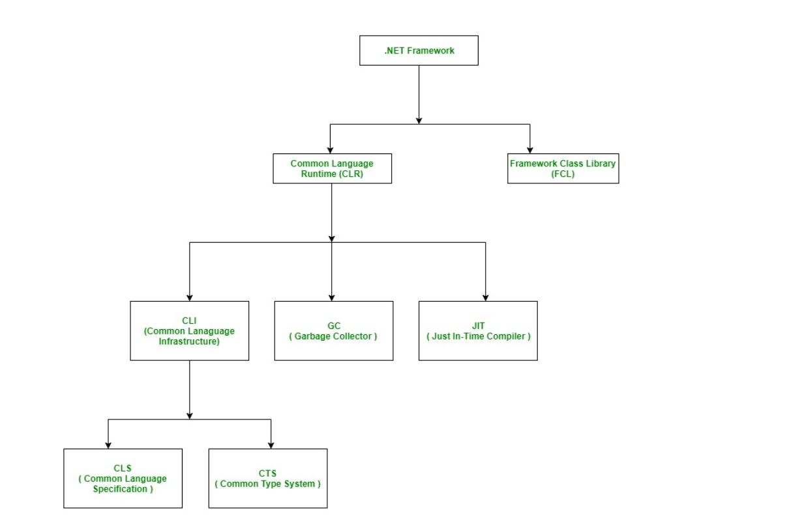

# The Common Language Runtime (CLR)

The Common Language Runtime (CLR) is a core component of the .NET framework, providing a runtime environment for managing and executing code written in various .NET programming languages. It serves as a virtual machine responsible for executing .NET applications.

it compiles the source code of applications developed using .NET supported languages into CLR's intermediate language(IL) called MSIL(microsoft intermediate language). this code is platform independent. Metadata is also generated during compilation. This metadata is generally about members and types required by CLR to execute MSIL code. A just-in-time compiler component of CLR converts MSIL code into native code of the machine

## Key Components of CLR:

### Common Type System (CTS):

- CTS establishes guidelines for defining and using data types at runtime, ensuring compatibility and interoperability between different .NET languages.
- It categorizes types into value types (e.g., integers, enums) and reference types (e.g., classes, arrays), facilitating language-independent coding.

### Common Language Specification (CLS):

- CLS defines a set of rules that .NET languages must follow to promote language interoperability.
- It enables seamless integration and interaction between different .NET languages, allowing developers to leverage functionalities across languages.

### Garbage Collector (GC):

- The Garbage Collector is responsible for automatic memory management in .NET applications.
- It allocates and deallocates memory for objects, ensuring efficient memory usage and preventing memory leaks.
- It automatically identifies and removes unreferenced objects, optimizing memory utilization.

### Just-in-Time (JIT) Compiler:

- The JIT Compiler translates MSIL (Microsoft Intermediate Language) code into native machine code at runtime.
- It compiles MSIL code into executable code specific to the target machine architecture, improving performance by reducing interpretation overhead.

### Metadata:

- Metadata contains binary information about .NET assemblies, including type definitions, member signatures, and assembly dependencies.
- It facilitates language interoperability and runtime type resolution, enabling the CLR to interpret and execute .NET code efficiently.

### Assemblies:

- An assembly is a fundamental unit of deployment and versioning in .NET.
- It encapsulates compiled code (MSIL), metadata, and resources into a single deployable unit.
- Assemblies facilitate code reuse, version control, and security permissions, simplifying application deployment and management.

By providing memory management, execution environment, and language interoperability, CLR enables developers to build robust, platform-independent applications using diverse .NET languages.
