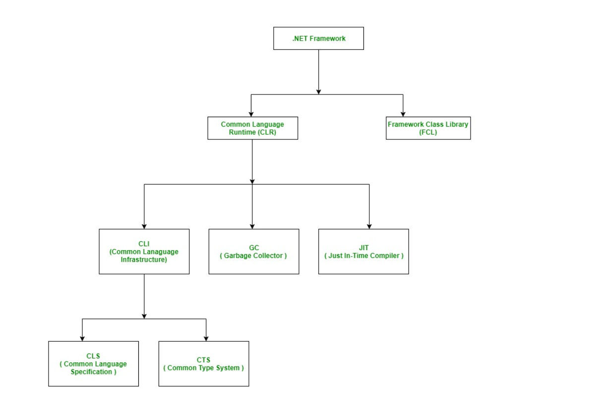

# Introduction to .NET Framework

The .NET Framework is a software development framework developed by Microsoft. Its first version was introduced in 2002. It is a virtual machine that provides a runtime environment and a set of libraries and tools for building and running applications on Windows operating systems. The framework includes a variety of programming languages, such as C#, F#, and Visual Basic, and supports a range of application types, including desktop, web, mobile, and gaming applications.

1. The .NET Framework includes two main components: the Common Language Runtime (CLR) and the .NET Framework Class Library. The CLR is responsible for managing the execution of code written in any of the supported languages, while the class library provides a large set of pre-built functions and classes that can be used to create a wide range of applications.

2. One of the key advantages of the .NET Framework is its support for a variety of programming languages. This means that developers can choose the language that best fits their needs and expertise, while still being able to use the same set of libraries and tools provided by the framework.

3. The framework includes libraries and tools for creating desktop, web, mobile, and gaming applications, which makes it a versatile choice for developers working on a wide range of projects.

4. The .NET Framework also provides a number of features that help improve the security, reliability, and performance of applications. These include features such as code access security, automatic memory management, and just-in-time (JIT) compilation.

5. The .NET Framework is also designed to integrate with other Microsoft technologies, such as Microsoft SQL Server, Microsoft SharePoint, and Microsoft Office.

In this section, we will understand the .NET Framework, characteristics, components, and its versions.

The main objective of this framework is to develop an application that can run on the windows platform. The current version of the .Net framework is 4.8.

## Components of .NET Framework

There are following components of .NET Framework:

- CLR (Common Language Runtime)
- CTS (Common Type System)
- BCL (Base Class Library)
- CLS (Common Language Specification)
- FCL (Framework Class Library)
- .NET Assemblies
- XML Web Services
- Window Services

### Two main components CLR and FCL:

#### CLR (common language runtime)

**Common Language Runtime (CLR):** CLR is the basic and Virtual Machine component of the .NET Framework. It is a run-time environment responsible for managing the execution of code written in any of the .NET-supported languages like C#, Visual Basic, etc. CLR loads the required libraries and compiles the code into machine code that can be executed by the computer’s processor. The CLR also provides a number of services, such as automatic memory management and security, that help ensure that applications are reliable and secure.

#### CTS (Common Type System)

**Common Type System (CTS):** It specifies a standard that represents what type of data and value can be defined and managed at runtime. A CTS ensures that programming data defined in various languages should interact with each other to share information. It enables cross-language integration and provides an object-oriented model to help implement many programming languages. It defines rules that languages must follow, which helps ensure that objects written in different languages can interact with each other.

#### CLS (Common Language Specification)

**Common Language Specification (CLS):** It is a subset of the common type system (CTS) that defines a set of rules and regulations which should be followed by every language that comes under the .NET framework. In other words, a CLS language should be cross-language integration or interoperability. For example, in C# and VB.NET language, the C# language terminates each statement with a semicolon, whereas in VB.NET it does not end with a semicolon. When these statements execute in .NET Framework, it provides a common platform to interact and share information with each other.

#### .NET Binaries

**.NET binaries** refer to the compiled code files produced by the .NET compiler. These files contain instructions in a format called Intermediate Language (IL) or Common Intermediate Language (CIL), which is platform-independent and designed to be executed by the Common Language Runtime (CLR) in the .NET Framework or .NET Core runtime.

There are several types of .NET binaries:

1. **Assembly (.dll or .exe):**

   - An assembly is the basic unit of deployment in .NET. It can be either a dynamic link library (.dll) or an executable (.exe) file.
   - Assemblies contain IL code, metadata, and resources required for the application to run.
   - Assemblies can be referenced and used by other .NET applications.

2. **Intermediate Language (IL) files (.il):**

   - IL files contain human-readable Intermediate Language code generated by the compiler from the source code.
   - These files are not typically distributed with applications but can be useful for debugging or understanding the IL code produced by the compiler.

3. **Portable Executable (PE) files:**
   - PE files are the standard executable file format used by Windows operating systems.
   - .NET assemblies (.dll or .exe) are PE files with additional metadata specific to .NET.

#### Microsoft .NET Assemblies

**.NET assemblies:** A .NET assembly is the main building block of the .NET Framework. It is a small unit of code that contains a logical compiled code in the Common Language Infrastructure (CLI), which is used for deployment, security, and versioning. It defines in two parts (process) DLL and library (exe) assemblies. When the .NET program is compiled, it generates metadata with Microsoft Intermediate Language, which is stored in a file called Assembly.

#### FCL (Framework Class Library)

**Framework Class Library (FCL):** It provides various system functionality in the .NET Framework, including classes, interfaces, and data types, etc., to create multiple functions and different types of applications such as desktop, web, mobile applications, etc. In other words, it can be defined as, it provides a base on which various applications, controls, and components are built in .NET Framework.

#### BCL (Base Class Library)

**Base Class Library (BCL):** The base class library has a rich collection of libraries, features, and functions that help to implement many programming languages in the .NET Framework, such as C#, F#, Visual C++, and more. Furthermore, BCL divides into two parts:

- User-defined class library
- Predefined class library

#### Base Class Library (BCL) vs Framework Class Library (FCL):

**The Base Class Library** is a subset of the Framework Class Library.
It provides fundamental types and functionality that are essential for developing .NET applications.
The BCL includes core types such as strings, arrays, collections, streams, basic data types, input/output (IO) operations, threading, reflection, XML processing, and security.
It forms the foundation upon which the rest of the .NET Framework is built and is available across all .NET implementations.

**The Framework Class Library** encompasses the entire set of class libraries available in the .NET Framework.
It includes not only the Base Class Library but also additional libraries and APIs for specific functionalities such as Windows Forms, ASP.NET, ADO.NET, Windows Presentation Foundation (WPF), Windows Communication Foundation (WCF), and more.
The FCL extends beyond the core functionalities provided by the BCL to offer a comprehensive set of tools and libraries for building various types of applications.

## Characteristics of .NET Framework

### Advantages of .NET

- Object-Oriented: support object-oriented languages
- Multi-language support
- Visual Studio IDE
- Cross-Platform Design
- Easy Maintenance
- dotNET Core Supports a Wide Range of Applications
- .NET Core Enables Top App Performance
- Cost-Effective
- Large Community
- Integration with Microsoft Ecosystem or MS services
- Security and Reliability
- Rapid Development
- Security Features
- Scalability and Performance

### Disadvantages of .NET

- Limited Object-Relational Support
- Vendor Lock-in
- Memory Leaks
- Difficulty in the transition to .NET core
- Deployment and Size
- Learning Curve
- Platform Dependency
- Open-Source Challenges
- Community Perception
- Containerization Complexity
- Third-Party Integration

## Apps Built using the .NET Framework

### Interoperable Apps:

dotNET is the perfect option for building interoperable apps that offer a flawless user experience across a wide range of platforms.

### Gaming:

.NET is extremely versatile and thus it is a highly suitable framework for the development of gaming applications. The versatility offered by .NET also allows .NET developers to create seamless web and enterprise-graded applications.

### Re-Designing:

Organizations are not static, and their needs are also changing continuously. It is crucial to scale the software according to the growing needs.

dotNET is an excellent platform for re-designing applications and scaling them up according to the growing needs of the organization.

### Business Function:

Those days don’t exist anymore when business was conducted without the presence of applications and software.

Almost every business out there makes use of constructive applications and software to streamline their business operations. NET is broadly used in the creation of supply management applications and CRM.

### Multi-Tiered Software Architecture:

.NET utilizes multi-tiered software architecture. It is known as multi-tiered because it physically separates functions for app processing, data management, and presentation.

Utilizing this framework, developers can build flexible applications. Moreover, developers can also edit a layer without reworking the entire application.
